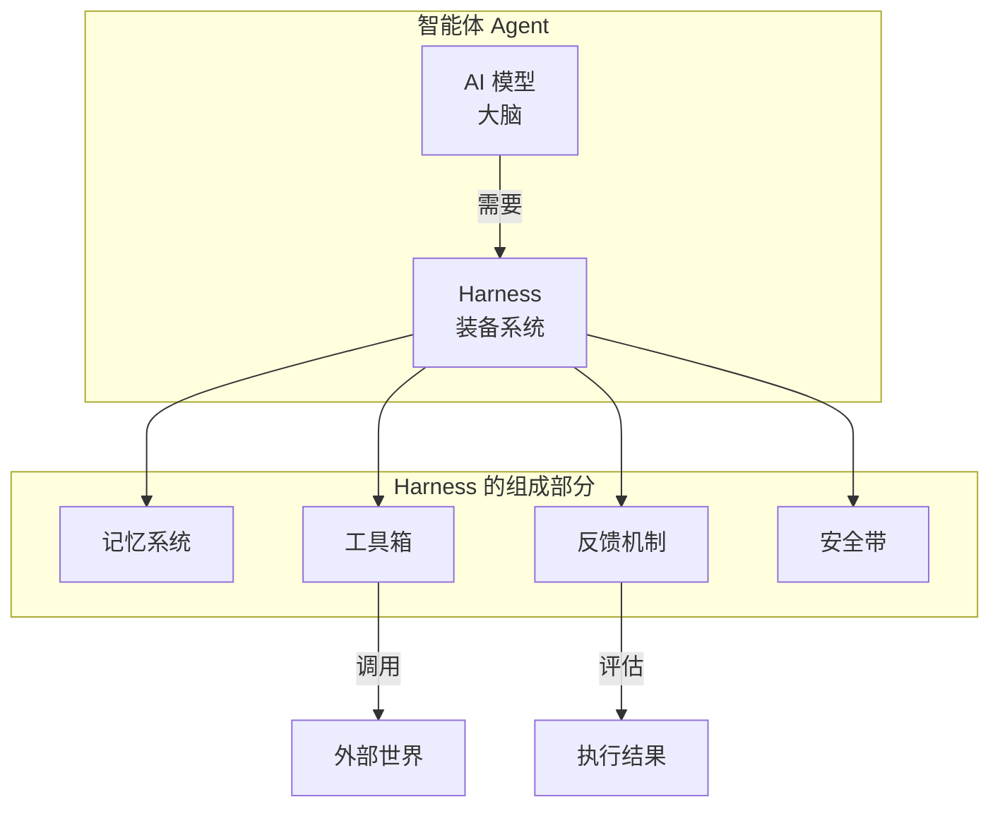

# Harness Engineering 是什么？给小白看的入门指南

最近在开发者圈子里，突然冒出一个新词叫 **Harness Engineering**。有人说，现在不用学 Prompt Engineering 了，也不用学 Context Engineering 了，只要学会这个就够了。

那它到底是个啥？这篇文章用大白话给你讲明白。

## 一、用大白话来说

想象一下，你有一个超级聪明但"不懂人间烟火"的大脑（这就是 AI 模型，比如 GPT-4）。

这个大脑知道很多知识：它懂编程、懂数学、懂写作，甚至懂怎么修车。但是它在真实世界里啥也干不了，因为：

- 🤷 它不知道怎么打开你的电脑
- 🤷 它不知道怎么调用你写的代码
- 🤷 它不知道自己上次说到哪了
- 🤷 它不知道什么时候该停下来
- 🤷 它不知道自己干的事儿成功了没有

**Harness** 就是把这一切都连接起来的"缰绳"和"装备"。就像骑马需要马鞍、缰绳、马镫一样，让 AI 这个"聪明的马"能真正干点有用的事儿。

所以有句话是这么说的：

```
┌─────────────────────────────────────────┐
│  Agent（智能体）= Model（大脑）+ Harness（装备）  │
└─────────────────────────────────────────┘
```

如果你不是模型，那你就是 Harness。

## 二、Harness 到底是啥？

简单来说，模型以外的东西都是 Harness。具体来说，它包括这几块：

### 1. 记忆系统

AI 的"上下文窗口"是有限的，就像人的短期记忆一样，记不住太多东西。Harness 要负责：

- 把重要的对话存起来，方便回头查看
- 知道哪些信息该记，哪些可以忘
- 当 AI 需要的时候，能快速找到相关记忆

### 2. 工具箱

光有大脑不行，还得有手有脚。Harness 给 AI 提供各种工具：

- 🔧 查数据库的接口
- 🔧 调用第三方 API 的能力
- 🔧 读写文件的功能
- 🔧 执行代码的环境

这些工具就像给 AI 装上了"手"和"脚"，让它能真正操作东西。

### 3. 反馈机制

AI 干完活了，得知道自己干得咋样：

- ✅ 任务完成了没？
- ❌ 哪儿出错了？
- 🔄 要不要再试一次？

没有这个反馈循环，AI 就像个瞎子，干啥都碰运气。

### 4. 安全带

AI 有时候会"胡说八道"或者"瞎折腾"，Harness 要给它加上约束：

- 🛡️ 别让它输出危险的内容
- 🛡️ 别让它调用不该调用的接口
- 🛡️ 别让它一直跑个没完

## 三、它们之间的关系



## 四、为啥突然火起来了？

这个概念的演进其实挺有意思的：

```
┌────────────────┬──────────────────┬─────────────────────┐
│   第一阶段      │    第二阶段       │      第三阶段         │
├────────────────┼──────────────────┼─────────────────────┤
│ Prompt         │ Context          │ Harness             │
│ Engineering    │ Engineering      │ Engineering         │
├────────────────┼──────────────────┼─────────────────────┤
│ 怎么跟 AI 聊天  │ 给更多背景信息    │ 造一个能干活的系统   │
└────────────────┴──────────────────┴─────────────────────┘
```

### 第一阶段：Prompt Engineering（提示工程）

最开始，大家都在研究怎么跟 AI"聊天"。发现用特定的方式提问，AI 会回答得更好。

比如：
- "你是一个专业的程序员"
- "请一步步思考"
- "先分析再给出结论"

这就像在培训一个"聊天机器人"，让对话更顺滑。

### 第二阶段：Context Engineering（上下文工程）

后来发现光聊天不够，得给 AI 更多背景信息。比如让它写代码，你得先把项目结构、代码规范告诉它。

这就像给聊天机器人"喂资料"，让它懂更多。

### 第三阶段：Harness Engineering（装备工程）

现在大家意识到：光聊天、光给资料都不行，得把 AI 放到一个完整的系统里，让它能真正干活。

这就像给 AI 装上"手脚"和"大脑外挂"，让它成为一个真正的智能助手。

## 五、一个简单的例子

假设你想让 AI 帮你查数据库并生成报表：

| 只有 Prompt Engineering | 有 Harness Engineering |
|:---:|:---:|
| 你问 AI："帮我查用户数据" | AI 调用数据库接口，拿到数据 |
| AI 说："我没法查数据库" | AI 分析数据，生成图表 |
| 你说："那我自己查吧..." | AI 把报表发给你 |
| **对话结束** | **任务完成** |

这就是区别。

## 六、给开发者的建议

如果你是个开发者，想学习 Harness Engineering，这里有几个方向：

1. **学习 LangChain / LangGraph**：目前最流行的 Agent 框架
2. **了解 Function Calling**：让模型能调用外部工具
3. **掌握 RAG 技术**：给模型配上"知识库"
4. **学习工作流编排**：把多个步骤串起来

## 七、总结

**Prompt Engineering 是教 AI 怎么说话，Harness Engineering 是给 AI 一套能干活的装备。**

- 前者像是在培训一个"聊天机器人"
- 后者是在造一个"真正的智能助手"

随着 AI 的发展，我们已经过了"和 AI 聊天"的阶段，进入了"让 AI 干活"的时代。而 Harness Engineering，就是这个时代的核心技能。

---

> 参考来源：LangChain 作者 Vivek Trivedy 的博客《The Anatomy of an Agent Harness》
